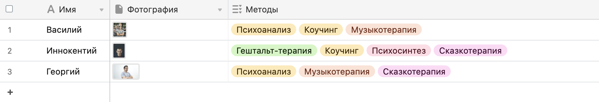

## CLI-script
When executed, fetches the data from [airtable](https://airtable.com/tbluLvKNHYbfB9dIx/viwrSuC004YewKyGr?blocks=hide) using AirtableAPI and converts the table data into a relational database, which is then inserted into PostgreSQL database running on the Docker container.

Functionality breakdown:
1. Get JSON data using AirtableAPI.
2. Unpack and separate the data into separate tables using [Pandas](https://pandas.pydata.org/) and complete the normalisation process.
3. Insert the achieved dataframes into PostgreSQL database.

A snapshot of the initial data format:

```json
{
            "id": "recV73dV4CcUq88IY",
            "fields": {
                "Имя": "Василий",
                "Фотография": [
                    {
                        "id": "attY7G4ysiIDnSaUw",
                        "url": "https://dl.airtable.com/.attachments/7da0d4c7963babf742137abc4e9a1a99/5f547505/1.jpg",
                        "filename": "1.jpg",
                        "size": 1045553,
                        "type": "image/jpeg",
                        "thumbnails": {
                            "small": {
                                "url": "https://dl.airtable.com/.attachmentThumbnails/33589c8479683db065f99673a5f5a4fe/0c0abe62",
                                "width": 27,
                                "height": 36
                            },
                            "large": {
                                "url": "https://dl.airtable.com/.attachmentThumbnails/294c23dbb27ebc13b3b83f5225dcd90f/c31bee49",
                                "width": 512,
                                "height": 683
                            },
                            "full": {
                                "url": "https://dl.airtable.com/.attachmentThumbnails/90e6285452aacd6ffa975e76cc2dfea3/e74d7881",
                                "width": 3000,
                                "height": 3000
                            }
                        }
                    }
                ],
                "Методы": [
                    "Психоанализ",
                    "Коучинг",
                    "Музыкотерапия"
                ]
            },
            "createdTime": "2021-02-02T14:29:36.000Z"
        }
```

ERD of the normalised database:

    
Upon any subsequent runs, the script adds any new records that were added to the Airtable, updates if any were updated and removes if any were removed.

## front-end
Contains a Django project, which renders the data from the database - the data we collected through the CLI script. It's just a simple mock-up, nothing fancy; my first experience using Django.
*note: needs to be refactured and is under construction.

### The structure of a missing file in config.ini, in folder CLI-script/config/
````python
[postgresql]
host = localhost
database = psychotherapists
user = postgres
password = password
port = 5432

[airtable]
api_key = api_key_val
base_ID = base_ID_val
url = full_url_w_tablename
table_name = tablename
````
